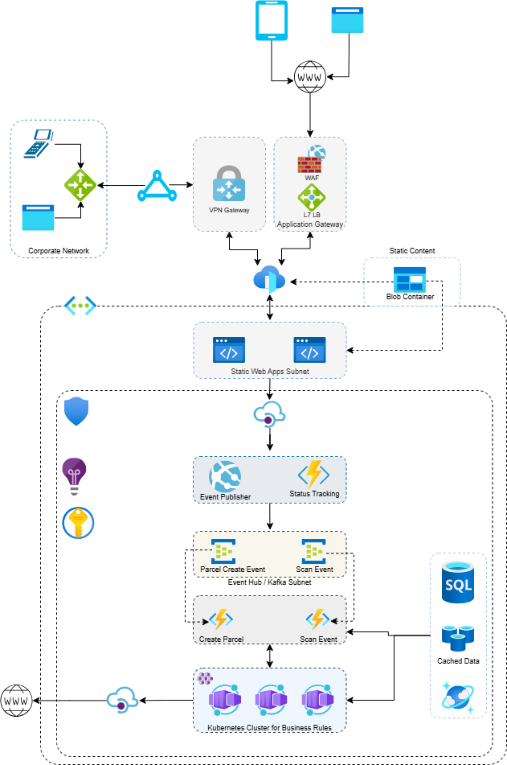

# Parcel Tracking PoC
A light weight application using .Net Core Web API, Azure Functions, Azure Event Hub, Azure Cosmos DB. This application is a very high-level PoC and developed for Azure PaaS environment.

## Core Components
This application has four key components
- .Net Core Web API
- Azure Event Hub
- Azure Functions
- Azure Cosmos DB
# 

### .Net Core Web API
This application will accept requests from user facing Single-Page-Applications (SPA). This application handles request for,

- New shipment creation
- Scan events during shipment operation
- Track status of the shipment

This is a minimal API application using .net core v.8 framework.

### Azure Event Hub
Web API application publishes shipment booking (new parcel) and scan events to Azure Event Hub and processed by Azure Functions.

### Azure Functions
Performs a subscriber for published events in Azure Event Hubs. This application uses two triggers,
- Eventhub Trigger: Consume events published by Web API
- Http Trigger: Provides a basic API functionality to provide data for tracking status request.
- Handles DB operation and performs business logic on published events.
- Scan events are following,
```csharp
COLLECTED = 1, SRC_SORT = 2, DEST_SORT = 3, DELIVERY_POINT = 4, DELIVERY_READY = 5, DELIVERED = 6, DELIVERY_FAIL = 7, DELIVERY_RETRY = 8, DELIVERY_RETURN = 9
```
### Azure Cosmos DB
Data store for published events. It is uses two containers to store data,
- Parcels: Parcel details are stored (e.g., Source Address, Sender Detail, Destination Address, Receiver Detail, etc). Partition key is '/ParcelId' and unique key is '/Id'.
- Events: Event details are stored (e.g., COLLECTED, SRC_SORT, DEST_SORT, etc.). Partition key is '/TrackingId' and no unique key.
## Disclaimer 
This application is a very high-level PoC and following are limitations or points to be considered to give it a try.
- This application is not deployed and tested in Azure environment but it ensures with little changes in configuration and settings it will work in Azure environment.
- This application uses Azure emulators for Azure EH and Azure Cosmos DB for development purpose. Therefore, development environment should have the emulators installed and configured properly.
- Security, Scalability, and Performance considerations were not made except local JWTs were used in Web API.
- Unit tests and other tests are not present at this moment.

### Payload Sample for New and Scan
New Parcel
```javascript
{
    "actorId": "CX1720",
    "actorType": "OPS",
    "eventType": "FAILED",
    "locationId": "FG01",
    "hubType": "SORTING",
    "senderData": {
      "name": "Jesselyn Casetti",
      "phone": "3137400714"
    },
    "receiverData": {
      "name": "Chance Littrik",
      "phone": "7734618713"
    },
    "parcelData": {
      "trackingId": "3353708127",
      "width": 96,
      "height": 44,
      "length": 38,
      "weight": 28,
      "sourceAddress": {
        "Address1": "7734 Anhalt Road",
        "Address2": null,
        "city": "Dearborn",
        "postalCode": 83733,
        "country": "US"
      },
      "destinationAddress": {
        "address1": "5126 Hermina Park",
        "address2": "Suite 49",
        "city": "Chicago",
        "postalCode": 73486,
        "country": "US"
      }
    },
    "receiverNotification": true
  }
```
Scan event for Source Sort
```javascript
{
	"trackingId": "3353708127",    
	"actorId": "CX1270",
	"actorType": "OPS",
	"locationId": "FG02",
	"hubType": "SORTING",	
	"eventType": "SRC_SORT"
}
```
Scan event for Destination Sort
```javascript
{
	"trackingId": "3353708127",    
	"actorId": "CX1270",
	"actorType": "OPS",
	"locationId": "FG02",
	"hubType": "SORTING",	
	"eventType": "DEST_SORT"
}
```
## Future Architecture
Following diagram shows future architecture of the application.
# 
